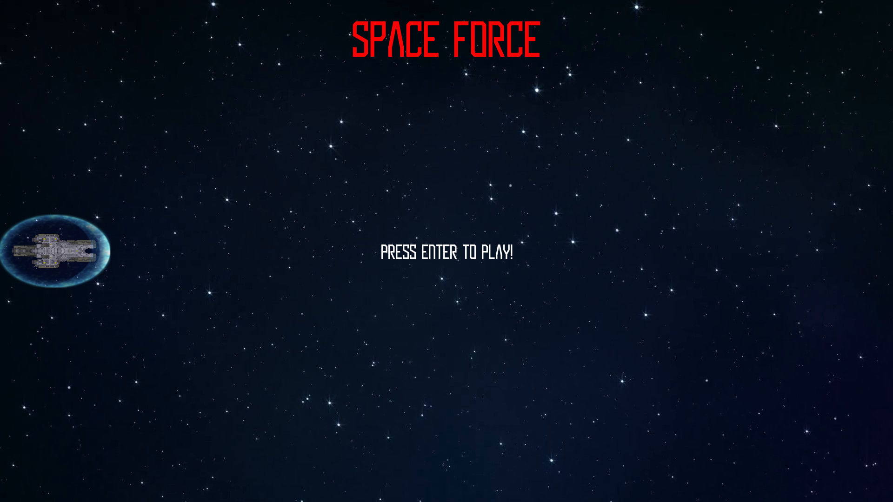

# Space Force

Space Invaders and Gradius knock-off created in [Pygame](https://www.pygame.org/wiki/about) using [Python](https://www.python.org/).

# Run

First, make sure Python is downloaded on your computer.

> Python can be downloaded [here](https://www.python.org/downloads/)

Then, run <code>pip install -r requirements.txt</code>

Finally, run **main.py** by using the command <code>python main.py</code> in the directory of the game